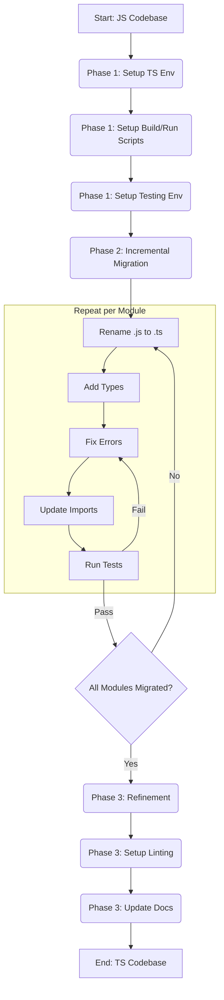

# Server TypeScript Migration Plan

This document outlines the plan for migrating the `server` codebase from JavaScript to TypeScript.

## Agreed Approach

- **Strategy:** Incremental migration, module by module.
- **Build Process:** Use `tsx` for development (`npm run dev`) and `tsc` for production builds (`npm run build`).
- **Testing:** Use `ts-jest` for Jest integration. Run tests (`npm run test`) after each significant step/module migration to ensure stability.
- **Knex:** Keep `knexfile.cjs` and migration files (`*.cjs`) as CommonJS for simplicity initially.
- **Linting:** Adapt the root ESLint configuration for TypeScript during the refinement phase.

## Migration Phases

### Phase 1: Setup & Configuration

1.  **Install Dependencies:** Add TypeScript, `tsx`, and necessary `@types/*` dev dependencies (`@types/node`, `@types/express`, `@types/cors`, `@types/socket.io`, `@types/jest`, `@types/pg`, `@types/bcryptjs`, `@types/jsonwebtoken`, `@types/uuid`) to `server/package.json`.
2.  **Create Server `tsconfig.json`:**
    - Create `server/tsconfig.json`.
    - Configure it for Node.js/ES Module environment (e.g., `target: "ES2020"`, `module: "NodeNext"`, `moduleResolution: "NodeNext"`).
    - Set `outDir: "./dist"` and `rootDir: "."`.
    - Enable essential strictness options (`strict: true`, `esModuleInterop: true`, `skipLibCheck: true`, `forceConsistentCasingInFileNames: true`).
    - Include all `.ts` files and `allowJs: true` during the transition.
3.  **Update `.gitignore`:** Add `/server/dist` to the root `.gitignore`.
4.  **Configure Jest for TypeScript:**
    - Install `ts-jest` as a dev dependency.
    - Create `server/jest.config.js`.
    - Set the preset to `ts-jest`.
    - Configure `testEnvironment: 'node'`.
    - Ensure `globalTeardown` path points correctly to the (potentially renamed) teardown script.
5.  **Update `package.json` Scripts:**
    - Add `build`: `"tsc --project ./server/tsconfig.json"` script.
    - Modify `start`: `"node ./server/dist/index.js"`.
    - Modify `dev`: `"tsx watch ./server/index.ts"`.
    - Modify `test`: Ensure it runs Jest using the new `server/jest.config.js`.
    - Keep `knex` scripts targeting the `.cjs` file.

### Phase 2: Incremental Migration (Module by Module)

- **General Process per Module:**
  1.  Rename file: `*.js` -> `*.ts`.
  2.  Add Types: Annotate function parameters, return types, variables, and class members. Define interfaces/types for complex objects (e.g., DB models, API payloads, socket events). Place shared types in `server/types/`.
  3.  Fix Type Errors: Address errors reported by `tsc`.
  4.  Update Imports/Exports: Use ES Module syntax (`import`/`export`). Ensure imports for `.ts` files have no extension (or `.js` if `moduleResolution` requires it - depends on final `tsconfig`).
  5.  Run Tests: Execute relevant tests (`npm run test`) and ensure they pass. Address any failures before proceeding.
- **Suggested Migration Order (Leaf nodes first):**
  1.  `logger.js` -> `logger.ts`
  2.  `db/pool.js` -> `db/pool.ts`
  3.  `db/dbUtils.js` -> `db/dbUtils.ts`
  4.  Define Interfaces/Types for DB models (e.g., in `server/types/db.ts`).
  5.  `db/users.js` -> `db/users.ts`
  6.  `db/poker.js` -> `db/poker.ts`
  7.  `db/retro.js` -> `db/retro.ts`
  8.  `db/velocity.js` -> `db/velocity.ts`
  9.  `db/workspaces.js` -> `db/workspaces.ts`
  10. `middleware/errorHandler.js` -> `middleware/errorHandler.ts`
  11. `middleware/auth.js` -> `middleware/auth.ts`
  12. Define Interfaces/Types for Socket events/payloads (e.g., in `server/types/sockets.ts`).
  13. `sockets/poker.js` -> `sockets/poker.ts`
  14. `sockets/retro.js` -> `sockets/retro.ts`
  15. Define Interfaces/Types for API routes/payloads (e.g., in `server/types/api.ts`).
  16. `routes/auth.js` -> `routes/auth.ts`
  17. `routes/poker.js` -> `routes/poker.ts`
  18. `routes/retro.js` -> `routes/retro.ts`
  19. `routes/velocity.js` -> `routes/velocity.ts`
  20. `routes/workspaces.js` -> `routes/workspaces.ts`
  21. `index.js` -> `index.ts` (Update imports, Express/Socket.IO types).
  22. `jest.globalTeardown.js` -> `jest.globalTeardown.ts`
  23. `__tests__/**/*.test.js` -> `__tests__/**/*.test.ts` (Update tests for TS).

### Phase 3: Refinement

1.  **Stricter `tsconfig.json`:** Once all files are migrated, consider disabling `allowJs` and enabling stricter checks (`noImplicitAny`, `strictNullChecks`, etc.) if not already done.
2.  **Linting Setup:** Configure ESLint for TypeScript using `@typescript-eslint/parser` and `@typescript-eslint/eslint-plugin` within the root `eslint.config.js` or a dedicated server config. Integrate Prettier if desired.
3.  **Documentation:** Update `server/README.md` with new setup, build, and run instructions for TypeScript.

## High-Level Migration Flow

